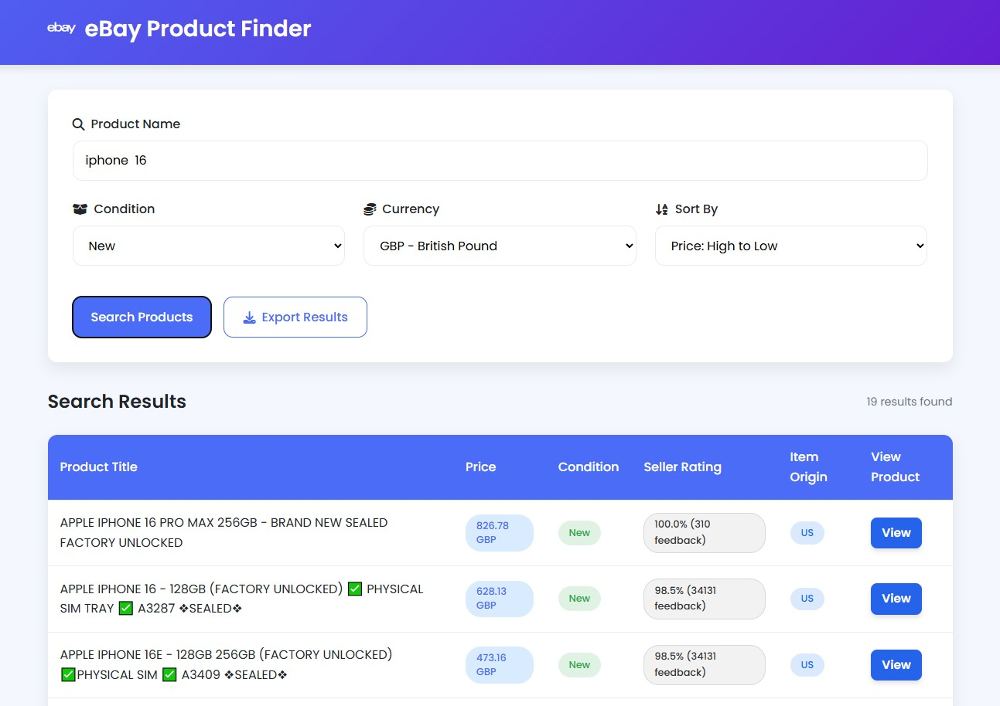

# 🛒 eBay Product Finder Web Application

[](https://e-commerce-app-d78j.onrender.com/) 
[](https://python.org)  
[](https://flask.palletsprojects.com)

A professional and responsive web application that searches eBay for products with advanced filtering, condition selection, currency conversion, and export capabilities.



---

## Features

- **🔍 Product Search**: Search eBay products by name  
- **⚙️ Condition Filtering**: Filter results by New, Used, or All item conditions  
- **💱 Currency Conversion**: Supports multiple currencies (USD, EUR, GBP, JPY, CAD, CNY, HKD, AUD, SGD, CHF)  
- **📊 Sorting Options**: Sort results by price or seller rating (ascending/descending)  
- **📁 Export Functionality**: Export data to CSV, Excel, or JSON  
- **📱 Responsive Design**: Fully mobile-friendly user interface  

---

## Technologies Used

- **Backend**: Python 3.12, Flask  
- **APIs**: eBay Browse API, Exchange Rate API  
- **Data Processing**: Pandas  
- **Frontend**: HTML, CSS, JavaScript  
- **Caching**: Flask-Caching  
- **Rate Limiting**: Flask-Limiter  
- **Deployment**: Gunicorn (Render-ready)  
- **Infrastructure**: GitHub, Render  

---

## Project Structure

```
ebay-product-finder/
├── app.py              # Main Flask application
├── auth.py             # eBay OAuth2 token handling
├── api_fetcher.py      # eBay API integration
├── processor.py        # Data filtering, sorting, and formatting
├── exporter.py         # CSV, Excel, JSON export functions
├── exchange.py         # Currency conversion logic
├── exceptions.py       # Custom exception handling
├── requirements.txt    # Python dependencies
├── render.yaml         # Render deployment configuration
├── static/
│ ├── css/
│ │ └── styles.css      # Custom styles
│ └── js/
│ └── script.js         # Client-side logic
├── templates/
│ └── index.html        # Main HTML template
└── README.md           # Project documentation
```

---

## Key Functionality

### 🔎 Product Search Workflow

1. User enters a product keyword  
2. Backend sends a request to the eBay Browse API  
3. The system filters items by selected condition (New, Used, All)  
4. Currency is converted based on selected preference  
5. Results are sorted by price or rating  
6. Displayed in a styled and responsive table  
7. User can export the data in CSV, Excel, or JSON formats  

---

## ⚙️ Technical Highlights

- **eBay Authentication**: Uses OAuth2 to securely access the Browse API  
- **Token Refresh**: Automatically refreshes access tokens as needed  
- **Currency API Integration**: Converts prices in real time  
- **Rate Limiting**: Protects your API usage and prevents abuse  
- **Caching**: Stores previous results to speed up repeated searches  
- **Error Handling**: Handles API failures and bad inputs gracefully  

---

## Future Enhancements

- [ ] User login and search history 
- [ ] Pagination for results  
- [ ] Image previews in result table 
- [ ] Save favorite searches  
- [ ] Add dark mode toggle

---

## License

This project is licensed under the MIT License — meaning you're free to use, modify, and distribute it with attribution.  
See [LICENSE](LICENSE) for full terms.

---

**Developed by Dimitar Karaskakovski**  
[GitHub Portfolio](https://github.com/dimitar-sudo)

